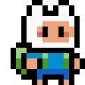
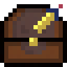

# Finn Found Da Chest 


Finn Found Da Chest is a 2D adventure game inspired by the Adventure Time universe. In this game, players control Finn the Human as he explores a mysterious world filled with obstacles and challenges.

## Table of Contents
- [How to Play](#how-to-play-![FinnStay])
- [Generating Pandoc](#generating-pandoc)
- [Credits](#credits)
- [Author & Links](#author--links)


## How to Play 

###  Controls: 
- Movement: ZQSD or arrow keys
- Toggle in-game Music  : M (Press once to stop, press again to play)
- Toggle Debug Mode: T (Press once to show player coordinates and latency, press again to hide)
- Debugging:
  - Show FPS while playing: Displayed in the terminal
  - Show Latency: Displayed in the terminal (when debug mode is toggled)
  - Show Player Coordinates: Displayed in the terminal (when debug mode is toggled)

###   Goal: 
- Explore the world to find keys that unlock doors.
- Use keys to unlock doors and progress through the game.
- Find the treasure chest and unlock it with a key to win the game.

###  Notes: 
- The game is a speedrun-style adventure.
- Graphics feature custom sprites of Finn created by Gaspard Catry.
- The map layout is fixed and not randomly generated.
- Additional features and improvements may be implemented in the future, but no updates are planned at this time.

## Generating Pandoc
To generate the Pandoc HTML output, use the following command:

  ```bash pandoc FinnFoundDaChest.md -o FinnFoundDaChest.html --css=./css/style.css --standalone --section-divs
  ```
  
### Prerequisites:objectsur local machine.
1. Navigate to the project directory.
2. Compile the Java files:
    ```bash
    javac -d ./bin ./src/*.java
    ```
3. Run the game:
    ```bash
    java -cp ./bin:./res main.Main
    ```

4. Run the game with the run command:
    ```bash
    bash ./run
    ```

## Credits:
- Game development based on tutorials by RyiSnow: [YouTube](https://www.youtube.com/@RyiSnow)
- Additional code and modifications by Gaspard Catry


## Author & Links
- Author: Gaspard Catry
- [Link to GitLab Repository](https://gitlab.univ-lille.fr/gaspard.catry.etu)
- Linktree
[](https://linktr.ee/Gaspard4i)

